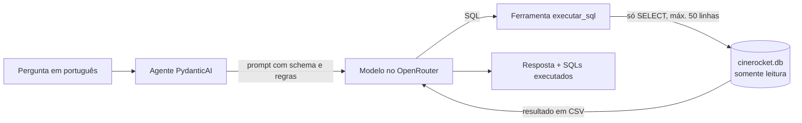

# CineData Analytics: Agente Text-to-SQL

Agente que responde perguntas em português sobre o catálogo de filmes da CineData, gerando e executando consultas SQL (somente leitura) na camada Gold. A ideia é colocar os dados nas mãos de quem não sabe SQL: a pessoa pergunta "qual produtora teve o maior lucro?" e o agente consulta o banco e responde.

**Stack:** Python 3.12 · PydanticAI · OpenRouter (modelos gratuitos) · Jupyter Notebook · SQLite

## Como funciona



1. O agente envia a pergunta ao modelo junto com o schema do banco e as regras de negócio
2. O modelo escreve um SQL e chama a ferramenta `executar_sql`
3. A ferramenta valida o SQL, executa no banco e devolve o resultado em CSV. Se o SQL der erro, devolve a mensagem para o modelo corrigir e tentar de novo
4. O modelo lê o resultado e escreve a resposta. Junto com ela, o notebook mostra os SQLs executados, quantas requisições foram gastas e qual modelo respondeu

Uma pergunta típica gasta 2 requisições: uma para gerar o SQL e outra para escrever a resposta.

## Como rodar

### Pré-requisitos

- [uv](https://docs.astral.sh/uv/getting-started/installation/) instalado (ele baixa o Python 3.12 sozinho)
- Chave gratuita do [OpenRouter](https://openrouter.ai/keys) (não precisa de cartão)
- Arquivo `cinerocket.db`, disponível no drive da atividade. Ele tem ~580 MB, acima do limite do GitHub, por isso não está no repositório

### Passo a passo

**1. Clonar e instalar as dependências**

```bash
git clone https://github.com/nunnowdc/Atividade-GenAI-CineData-Analytics-Rocket-Lab-2026.git
cd Atividade-GenAI-CineData-Analytics-Rocket-Lab-2026
uv sync
```

O `uv sync` cria a pasta `.venv` com as versões exatas do `uv.lock`.

**2. Configurar a chave do OpenRouter**

```bash
cp .env.example .env           # no Windows (PowerShell): Copy-Item .env.example .env
```

Abra o `.env` e troque `sk-or-v1-sua-chave-aqui` pela sua chave.

**3. Colocar o banco na pasta `data/`**

O arquivo precisa ficar em `data/cinerocket.db` (com esse nome).

**4. Abrir o notebook**

- **VSCode:** abra `notebooks/agente_cinedata.ipynb` e, em *Select Kernel*, escolha o ambiente `.venv` do projeto
- **Jupyter Lab:** `uv run jupyter lab notebooks/agente_cinedata.ipynb`

**5. Rodar**

Use *Run All*.

> ⚠️ **Cota do OpenRouter:** a conta gratuita permite 50 requisições por dia. O *Run All* executa as 14 perguntas do desafio e os testes com o modelo real, gastando cerca de 35 requisições. Para só experimentar, rode até o fim da seção 10 (nada antes disso gasta cota) e faça suas próprias perguntas. A função `verificar_cota()` mostra quantas requisições restam, sem gastar nenhuma. A cota zera às 21h (horário de Brasília).

### Fazendo suas perguntas

```python
await perguntar("Quais os 10 filmes de animação com maior receita?")
await perguntar("E em dólar?", continuar=True)   # continua a conversa anterior
```

## Estrutura do projeto

```
├── data/
│   └── cinerocket.db          # banco SQLite (não versionado)
├── notebooks/
│   └── agente_cinedata.ipynb  # o agente, os testes e as perguntas do desafio
├── .env.example               # modelo do .env (a chave real fica no .env, que é ignorado pelo git)
├── pyproject.toml             # dependências do projeto
├── uv.lock                    # versões exatas das dependências
└── README.md
```

O notebook está dividido em seções:

| Seção | Conteúdo | Gasta cota? |
|---|---|---|
| 1 a 5 | Conexão somente leitura, exploração do banco, qualidade dos dados e respostas calculadas à mão | Não |
| 6 | Configuração: chave, modelos e verificação de cota | Não |
| 7 | Ferramenta `executar_sql` e seus testes | Não |
| 8 | Prompt de sistema: schema gerado do banco, regras de negócio e exemplos | Não |
| 9 | O agente e um teste com modelo falso | Não |
| 10 | Função `perguntar` e testes de fallback e memória (com modelos falsos) | Não |
| 10 (perguntas) | As 14 perguntas do desafio, os testes de guardrails e de memória | **Sim** |
